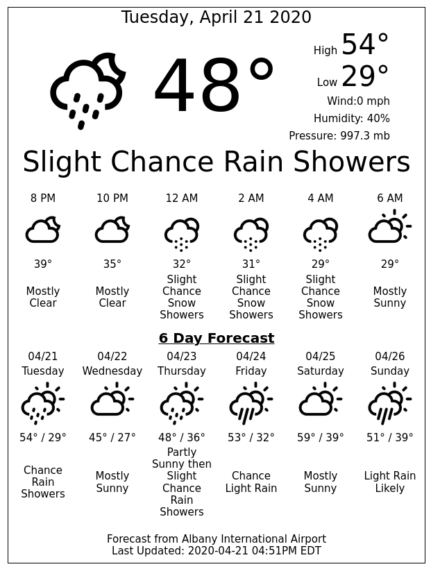

[NOAA/NWS](https://www.weather.gov) version of [nook-weather](https://github.com/TheCase/nook-weather).

#### Requirements
* A [rooted Nook Simple Touch](https://forum.xda-developers.com/showthread.php?t=2040351)
* ElectricSign installed. APK can be downloaded from [here](https://apkpure.com/electric-sign/com.sugoi.electricsign) or [here](./misc/Electric_Sign_v1.0.3.apk).
  * Source code available [jfriesne/Electric-Sign](https://github.com/jfriesne/Electric-Sign)
* Docker to run the server


#### Limitations
* As this pulls data from NOAA stations, it will likely only work for locations in the United States.
* Not all postal codes seem to work.  Querying zip codes using OpenStreetMaps' Nominatim API that associated with only Post Office boxes do not return a location despite being assigned a city.  If this occurs, please choose another local zip code.
* The postal code is used to find the nearest NOAA station.  Depending on your location, this may be far away.  Find the nearest station on the [NOAA/NWS website](https://www.weather.gov).


#### Icons
The icons provided with the NWS forecasts are not designed for e-ink displays and look like crap.  Instead, icons are mapped to equivalent ones from [erikflowers/weather-icons](https://github.com/erikflowers/weather-icons).

[Table of icon mapping](./icons.md)


```
docker build -t "nook-weather" .
docker run -d -p 3099:3099 -e EMAIL="test@example.com" -e ZIP_CODE=<YOUR_ZIP_CODE> --name "nook-weather" nook-weather
```



